<h1> The End is Nigh Randomizer is currently in BETA.</h1>

<h2>Check out the randomizer webpage below for more in-depth information, and more recent updates.</h2>

<a href="https://stuart-mouse.github.io/randomizer.html">Click Here!</a>

<h2>Current Features:</h2>

- randomized level order 
- randomized particle and shader effects 
- randomized palettes and music 
- randomized level and area names 
- randomized art alts 
- randomized physics (this one is crazy) 
- level corruptor 
- particle generator that creates new particles effects 
- mirror mode that flips every level horizontally 
- dead racer mode that applies a 6 minute timer to the run 
- most of the levels from the base game 
- levels from a few mods (contributed by the authors of those mods) 
- lots of settings, so you can play the way you want 
- support for easily adding new level packs 

<h2>Planned Features:</h2>

- complete level generation 
- more complex map layouts 
- realtime game memory manipulation 
- story mode??? 

<h2>Screenshots:</h2>

 
  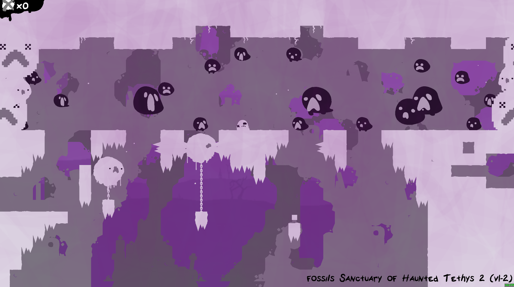
	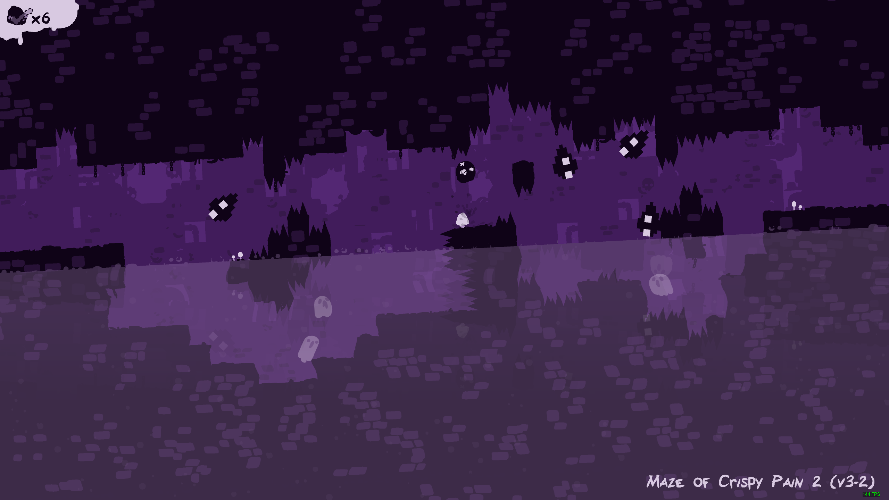
	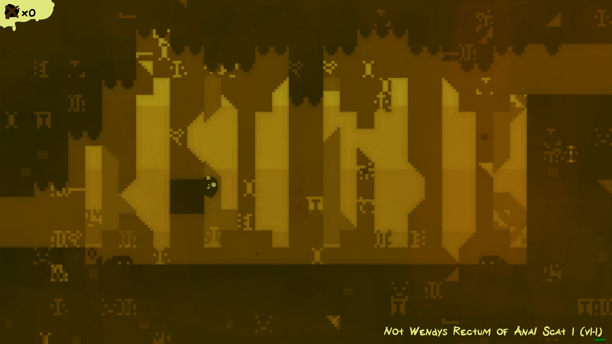
	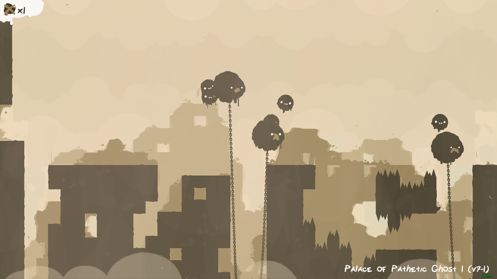
	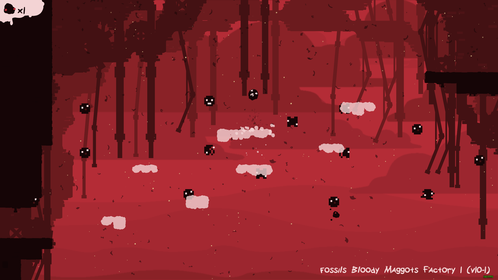
	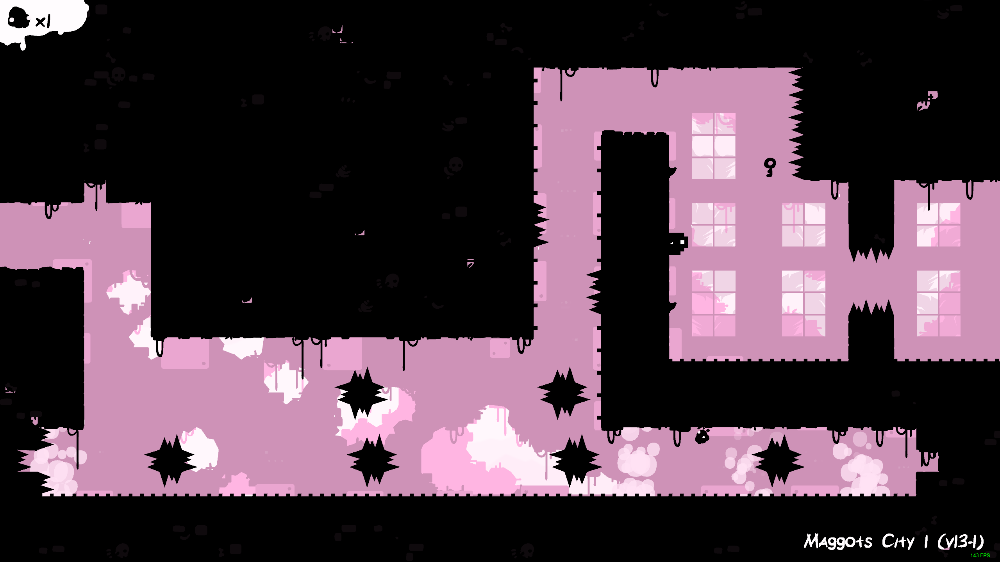
	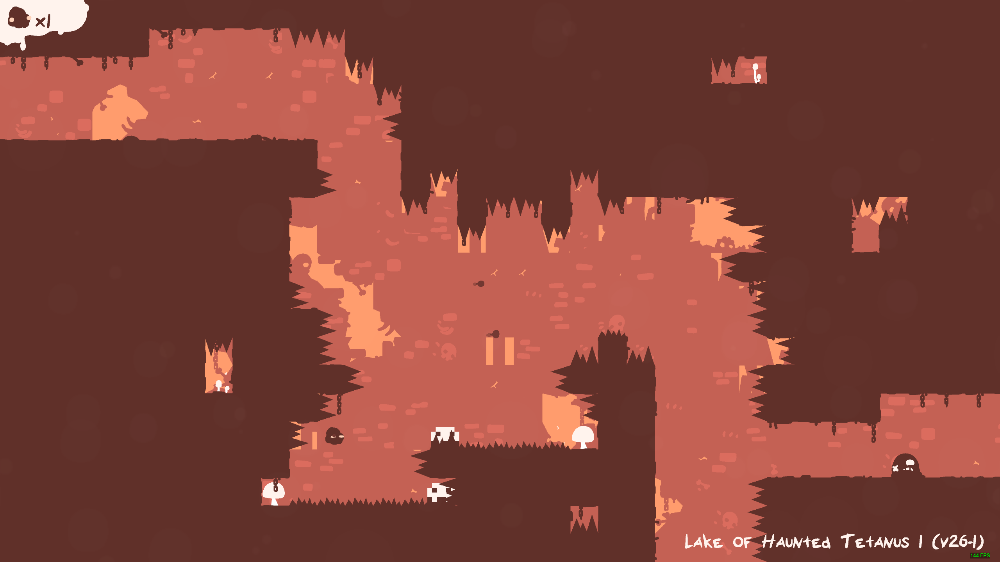
	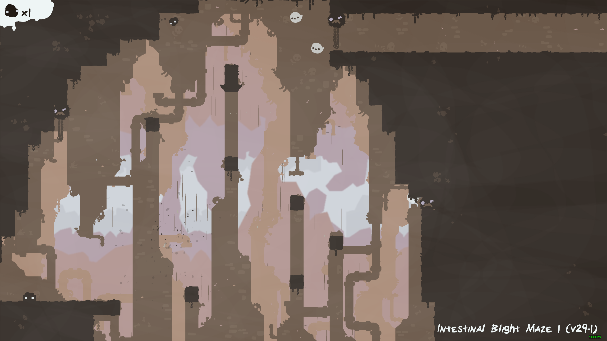
	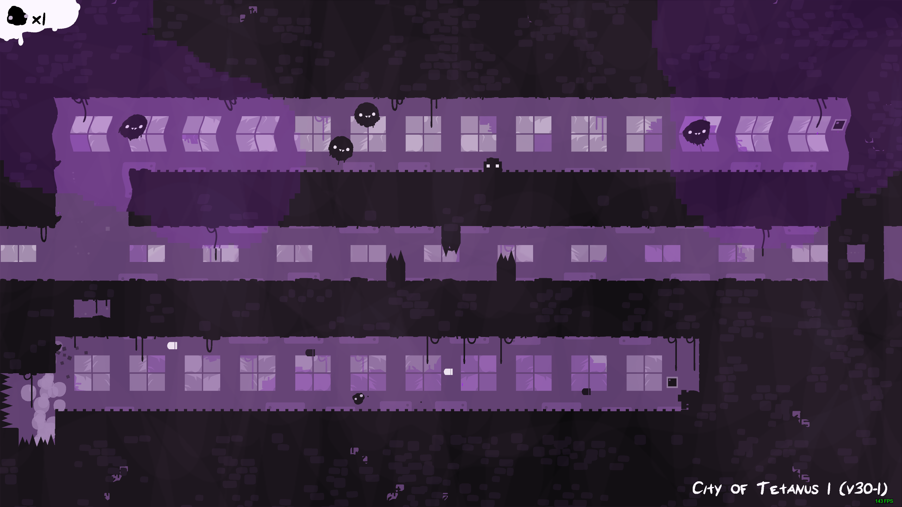
	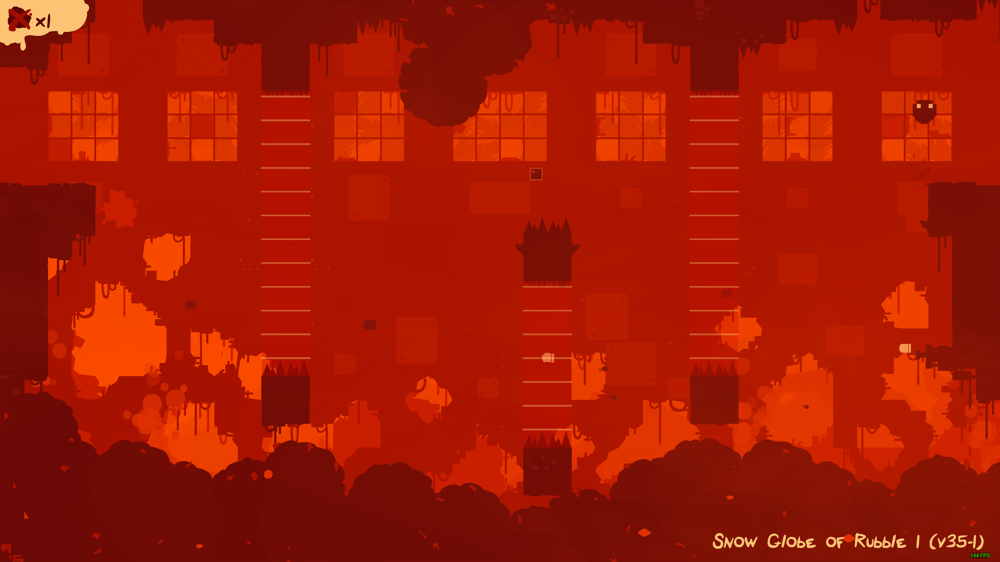
	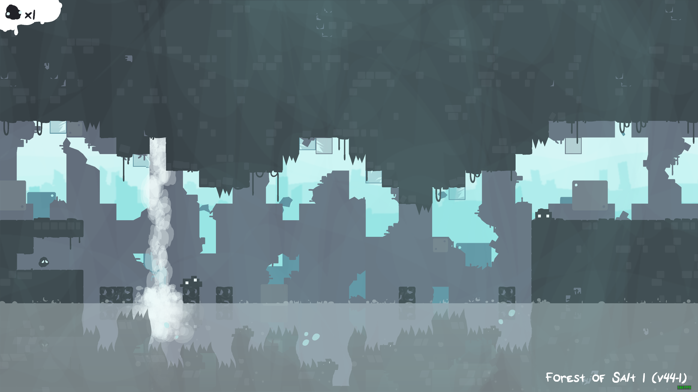
	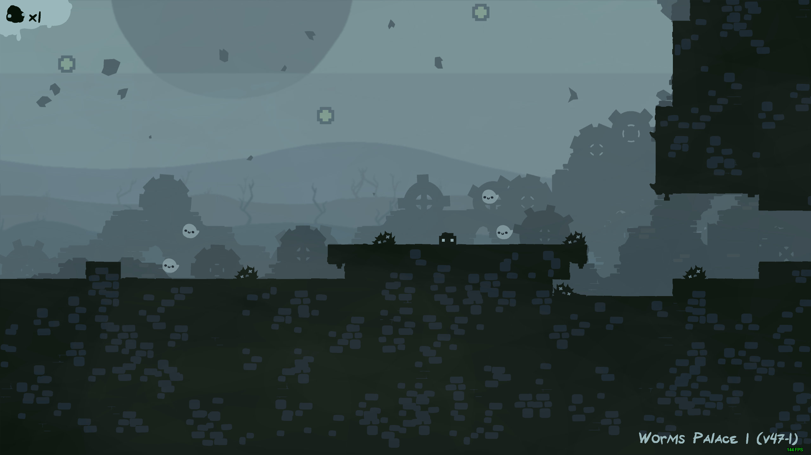
	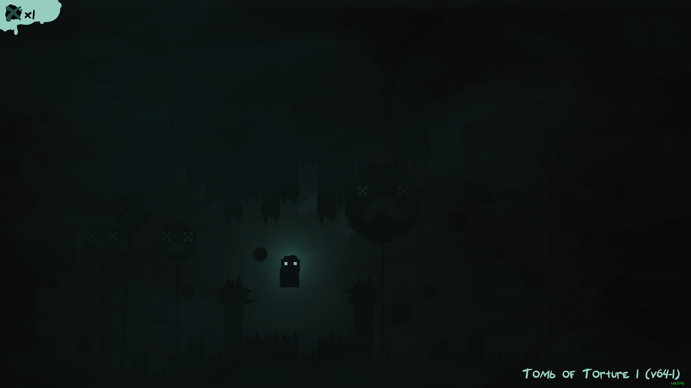
	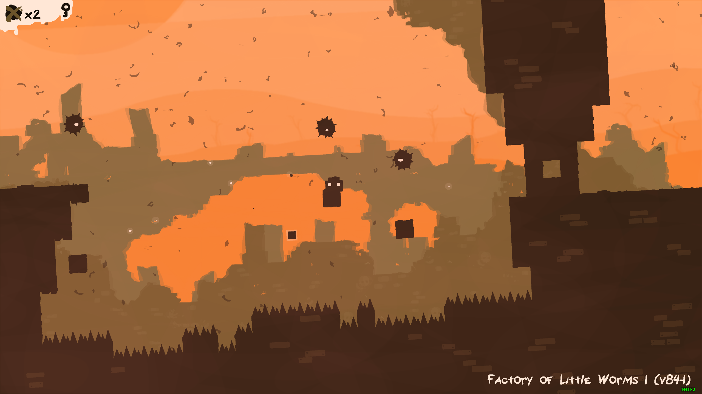

