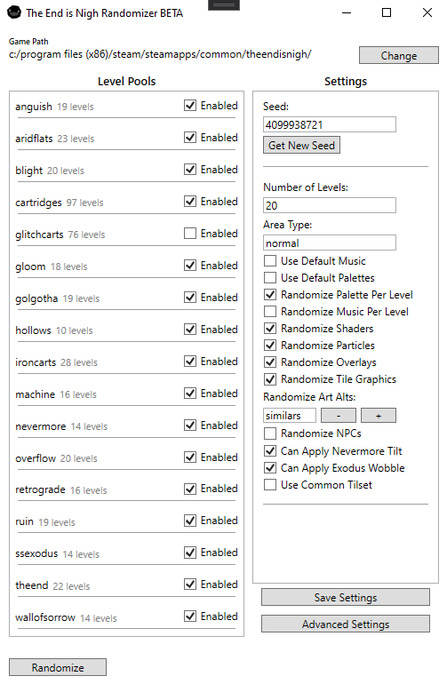

 
    

<h1>The End is Nigh Randomizer is currently in BETA.</h1>

<h2>Current Features:</h2>
- randomized level order 
- randomized particle and shader effects 
- randomized palettes and music 
- randomized level and area names 
- most of the levels from the base game 
- lots of settings, so you can play the way you want 
- support for easily adding new level packs 

<h2>Planned Features:</h2>

- more levels 
- more shaders 
- more particles, and 
- complete randomized creation of particle effects 
- more level/area names 
- better integration with the game 

<h2>Screenshots:</h2>

 
    
	
	
	
	
	
	
	
	
	
	
	
	
	

